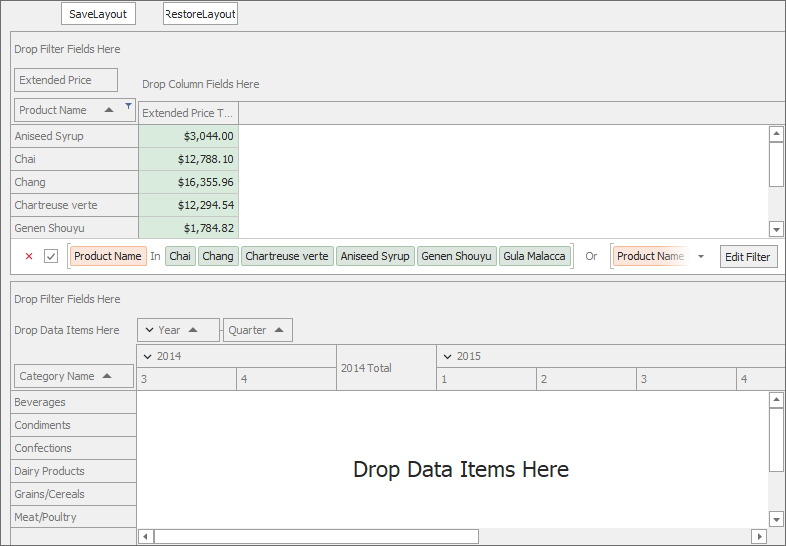
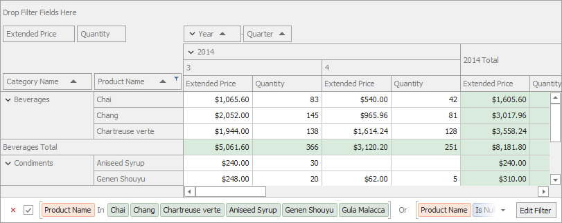

<!-- default badges list -->

# Pivot Grid for WinForms - Upgrade Layout

The example shows how to manage Pivot Grid layout on restore.

## Example Overview

The example contains two Pivot Grid controls with the following fields:

The **SaveLayout** button uses the [PivotGridControl.SaveLayoutToStream](https://docs.devexpress.com/WindowsForms/DevExpress.XtraPivotGrid.PivotGridControl.SaveLayoutToStream(System.IO.Stream)) method to save the `pivotGridControlOld` layout to memory streams.
The **RestoreLayout** button uses the [PivotGridControl.RestoreLayoutFromStream](https://docs.devexpress.com/WindowsForms/DevExpress.XtraPivotGrid.PivotGridControl.RestoreLayoutFromStream(System.IO.Stream)?p=netframework) method to restore the saved layout to `pivotGridControlNew`.

The following options allows you to combine fields from different Pivot Grid controls on restore:

* [PivotGridOptionsLayout.Columns.AddNewColumns](https://docs.devexpress.com/CoreLibraries/DevExpress.Utils.OptionsColumnLayout.AddNewColumns?p=netframework) set to true, keeps the field in the `pivotGridControlNew` control when you restore layout.
* [PivotGridOptionsLayout.Columns.AddNewColumns](https://docs.devexpress.com/CoreLibraries/DevExpress.Utils.OptionsColumnLayout.AddNewColumns?p=netframework) that is set to true, keeps the field in the `pivotGridControlNew` control when you restore layout.

* [PivotGridOptionsLayout.Columns.RemoveOldColumns](https://docs.devexpress.com/CoreLibraries/DevExpress.Utils.OptionsColumnLayout.RemoveOldColumns) set to false, adds fields from `pivotGridControlOld` to `pivotGridControlNew`.
* [PivotGridOptionsLayout.Columns.RemoveOldColumns](https://docs.devexpress.com/CoreLibraries/DevExpress.Utils.OptionsColumnLayout.RemoveOldColumns) that is set to false, adds fields from `pivotGridControlOld` to `pivotGridControlNew`.

* [PivotGridOptionsLayout.AddNewGroups](https://docs.devexpress.com/CoreLibraries/DevExpress.XtraPivotGrid.PivotGridOptionsLayout.AddNewGroups?p=netframework) set to `true`, keeps the "Year-Quarter" group of the `pivotGridControlNew` when you restore layout.
* [PivotGridOptionsLayout.AddNewGroups](https://docs.devexpress.com/CoreLibraries/DevExpress.XtraPivotGrid.PivotGridOptionsLayout.AddNewGroups?p=netframework) that is set to `true`, keeps the "Year-Quarter" group of the `pivotGridControlNew` when you restore layout.

* [PivotGridControl.LayoutUpgrade](https://docs.devexpress.com/WindowsForms/DevExpress.XtraPivotGrid.PivotGridControl.LayoutUpgrade?p=netframework) event adds the "Quantity" field to `pivotGridControlNew`'s data area when you restore layout.

The following image shows the resulting combination when you save the `pivotGridControlOld` layout and restore it to `pivotGridControlNew`:

## Files to Review

- [Form1.cs](.CS/WinPivotUpgradeLayout/Form1.cs) (VB: [Form1.cs](.VB/WinPivotUpgradeLayout/Form1.vb))
## Documentation

- [Save and Restore Layout](https://docs.devexpress.com/WindowsForms/1806/controls-and-libraries/pivot-grid/layout/save-and-restore-layout)

## More Examples

- [Pivot Grid for WinForms - How to Save and Restore the Pivot Grid Layout](https://github.com/DevExpress-Examples/winforms-pivotgrid-save-restore-state-and-layout)

